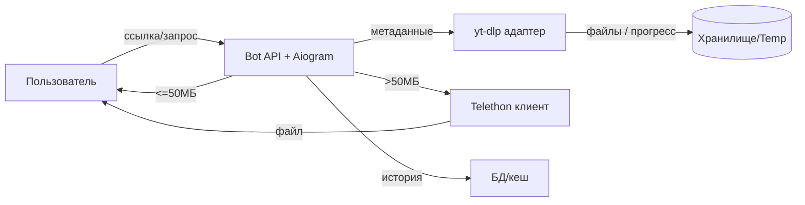
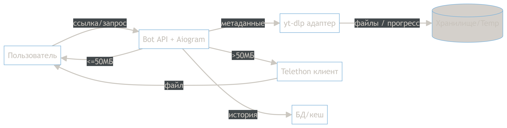
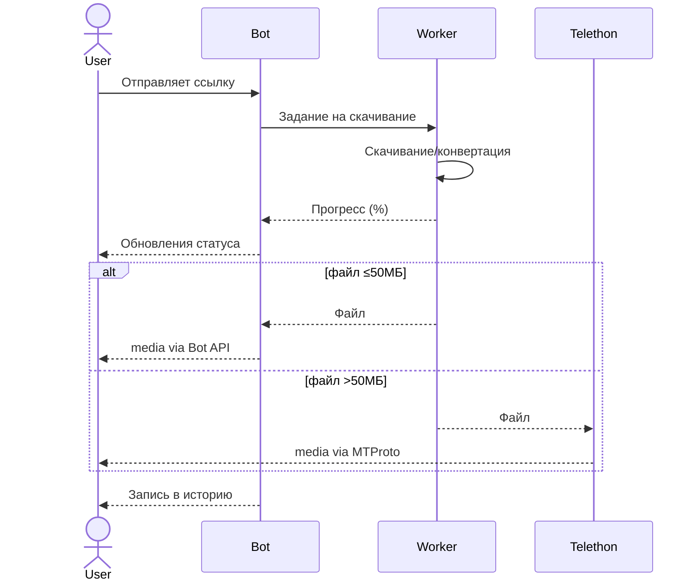

# Telegram Media Loader

## 1. Обзор и пользовательский опыт

- Пользователь отправляет ссылку (YouTube, Vimeo, TikTok и др.) или поиск.
- Бот показывает карточку: название, канал, длительность, превью.
- Пользователь выбирает режим (качество/формат) и получает файл.
- Для файлов >50МБ бот предлагает загрузку через Telethon.
- В интерфейсе доступны история скачиваний и прогресс выполнения.
- Пользователь может загрузить `cookies.txt` для приватных ресурсов.

## 2. Диаграммы

## 3. Задачи и оценки

| Задача                             | Детали                                         | Оценка  |
|------------------------------------|------------------------------------------------|---------|
| 1. ~~Поддержка новых платформ~~    | Конфигурация `yt-dlp`, валидация ссылок, тесты | 2 дня   |
| 2. ~~История скачиваний~~          | БД/kv-хранилище, команды просмотра, очистка    | 1.5 дня |
| 3. ~~Прогресс-бар - нереализуемо~~ | Очередь задач, отправка статусов, throttling   | 2 дня   |
| 4. ~~Telethon для >50МБ~~          | Клиент, авторизация, роутинг файлов            | 2.5 дня |
| 5. ~~UI улучшения~~                | Настройки качества/формата, карточки, обложки  | 1 день  |
| 6. ~~Cookies UX~~                  | Проверки, повтор задач, уведомления            | 0.5 дня |
| **Итого**                          | ~9.5 человеко-дней                             |

## 4. Дополнительные заметки

- Для прогресса использовать `progress_hooks yt-dlp`, передавать асинхронный `progress_cb`, который редактирует одно
  сообщение.
- Telethon-сессия хранится отдельно, требует защиту токенов.
- Историю ограничивать (например, последние 20 записей) для снижения нагрузки.
